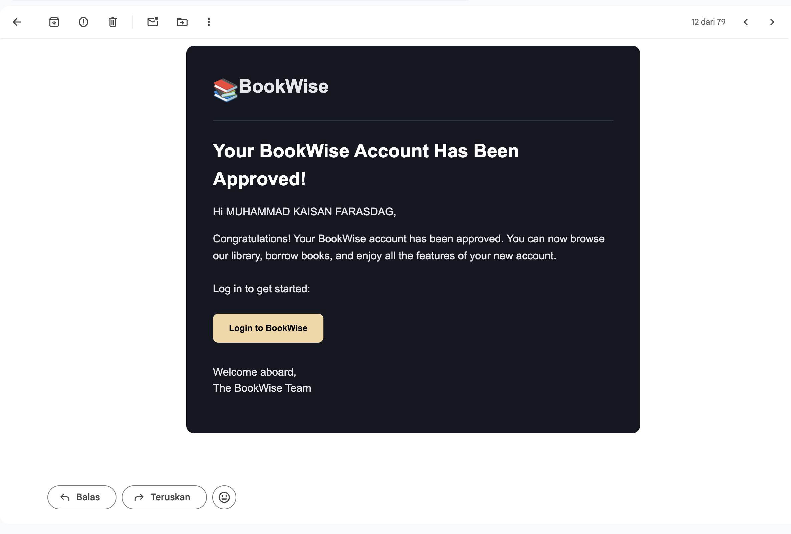
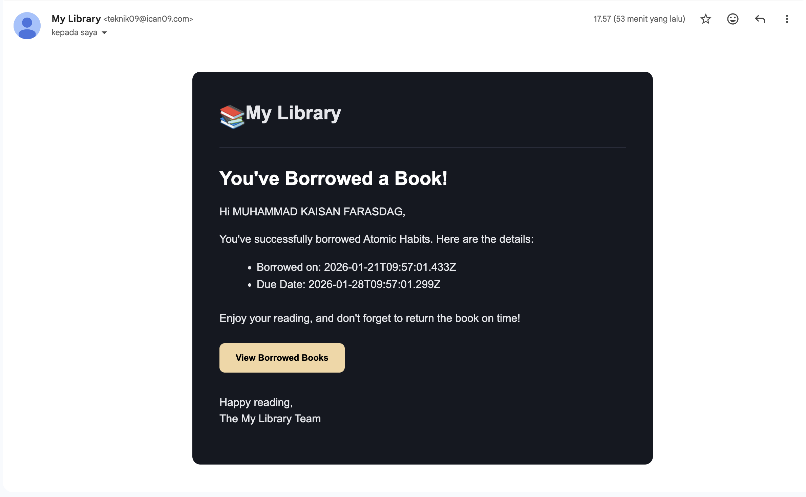
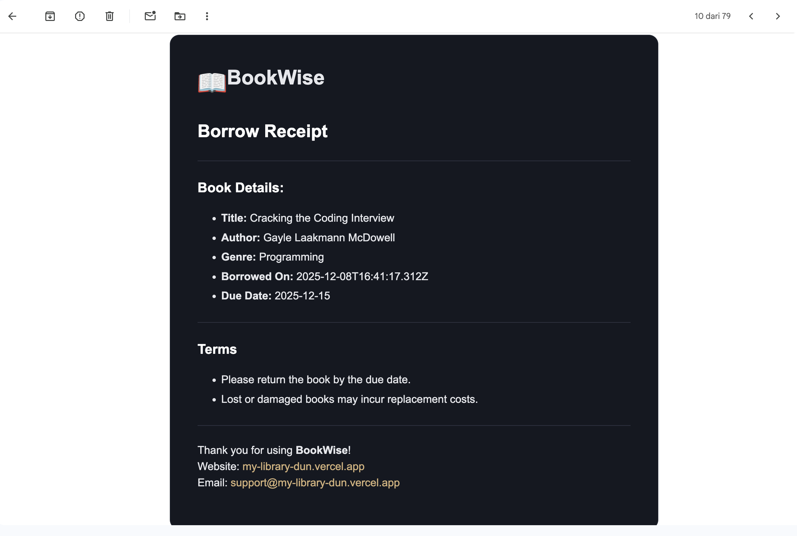
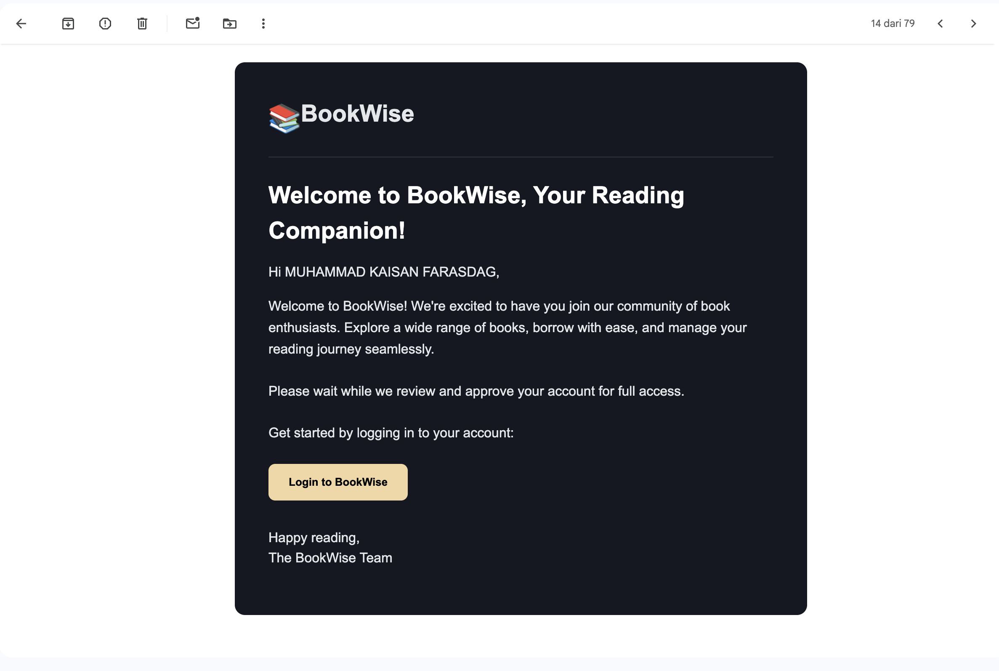

# 🛒 My-Library (Next.js)

A production-ready digital library system demonstrating:

- Server-first architecture with Next.js App Router
- Role-based access control (RBAC) enforced on the server
- Real-time borrowing workflows with concurrency safety
- Background email reminders using Upstash Workflows


## 🔗 Live Demo
https://my-library-dun.vercel.app


## 📦 Repository
https://github.com/Icann09/my-library


## 📸 Previews

### 🏠 Home Page
<p align="center">
  
</p>

### 📚 BookId, Search & Profile Pages
<p align="center">
  
  
  
</p>

### 🧑🏻‍💻 Admin Pages
<p align="center">
  
  
  
  
  
</p>

### 📧 Emails 
<p align="center">
  
  
  
  
</p>


## 🧠 Engineering Highlights

- Implemented database-level concurrency safety using unique constraints (user_id, book_id)
- Prevented race conditions with insert-first pattern and PostgreSQL error handling (23505)
- Enforced RBAC at layout, server action, and database levels
- Optimized data fetching with server components to reduce client bundle size
- Designed background job architecture using QStash for reliable serverless scheduling


## 🚩 Problem Statement
- Managing a digital library requires:
- Clear separation of responsibilities between users and administrators
- Secure authentication and authorization
- Reliable tracking of borrowed books and overdue items
- Time-based notifications that work even when users are inactive
- Traditional client-driven solutions and cron-based jobs are unreliable in serverless environments.


## ✅ Solution Overview
- This application solves these challenges by providing:
- Secure user authentication with session-based cookies
- Role-based access control (RBAC) enforced entirely on the server
- Server-first data fetching and mutations using Server Components and Server Actions
- Background workflows for overdue reminders using Upstash Workflows, enabling reliable, serverless email notifications


## 🧩 Challenges & Solutions

### Handling Duplicate Borrow Requests
Implemented a database-level unique constraint and graceful error handling to prevent race conditions when users attempt to borrow the same book simultaneously.

### Serverless Background Scheduling
Used Upstash QStash to reliably trigger overdue reminder workflows without relying on traditional cron jobs.


## ✨ User Roles & Features
👤 Users
- Sign up / sign in / sign out
- Browse and search books
- Borrow books
- View borrowed books and due dates
- Receive overdue reminder emails
- Track borrowing activity
🛠️ Administrators
- Admin-only dashboard
- Create, edit, and manage books
- Manage users and permissions
- Approve or reject account requests
- Edit borrowing records and statuses
- Generate receipts for borrowed books


## 🛠 Tech Stack
- Next.js 14 – App Router architecture
- React – Frontend framework
- Radix UI – UI components
- Tailwind CSS – Styling
- Drizzle ORM + PostgreSQL – Database
- Image Kit - Image and Video API
- Neon (PostgreSQL) – Database hosting
- NextAuth – Authentication
- Upstash Redis – Rate limiting
- Upstash QStash – Workflows and background jobs
- Resend – Transactional email service
- Sonner – Toast notifications
- Vercel – Deployment


## 🧪 Testing
- Unit testing for utility functions and business logic
- Manual QA for critical user flows (authentication, borrowing)


## 🧱 Architecture Overview
The application is built using a layered, server-first architecture with Next.js App Router.
High-level design:
- Server Components handle data fetching and protected rendering
- Client Components handle UI interactions and local state
- Server Actions manage all mutations (create/update/delete)
- Upstash Workflows handle background tasks (email reminders)


## 🔑 Core Architectural Decisions
1. App Router + Server Components (Server-First)
- Authentication and sensitive data never leave the server
- Reduced client bundle size
- Improved performance and security
2. Session-Based Authentication
- Sessions stored in HttpOnly cookies
- Secure user identification on every request
- No token exposure to the client
3. Role-Based Access Control (RBAC)
- Role validation enforced at:
- Layout level
- Server Actions
- UI checks used only for UX, never security
4. Server Actions for Mutations
- All create/update/delete logic lives on the server
- No API routes required
- Type-safe mutations colocated with business logic
5. URL-Based State & Search
- Filters and search parameters stored in the URL
- Shareable and bookmarkable pages
- Server-rendered data always stays in sync


## 🗄 Database Design
Core tables:
- users
- books
- borrow_records

Key constraint:
UNIQUE (user_id, book_id)


## 🛡 Error Handling
- Graceful server-side error handling in Server Actions
- User-friendly error feedback via toast notifications
- Centralized logging for debugging production issues


## 🔍 Trade-offs & Technical Decisions
Server Actions vs API Routes
Why Server Actions
- Reduced boilerplate
- Automatic server-side authentication
- Type-safe mutations
- Better alignment with App Router
Trade-offs
- Tighter coupling to Next.js
- Less reusable for external consumers (e.g. mobile apps)
- Requires careful optimistic UI handling
Decision
- Server Actions were chosen to prioritize security, maintainability, and developer productivity for a web-only application.


## 🚀 Getting Started

### 1. Clone the repo
```bash
git clone https://github.com/Icann09/my-library.git
cd my-library
```
### 2. Install Dependencies
```bash
npm install
```

### 3. Setup Environment Variables
env

DATABASE_URL=
NEXT_PUBLIC_IMAGEKIT_URL_ENDPOINT=
NEXT_PUBLIC_IMAGEKIT_PUBLIC_KEY=
IMAGEKIT_PRIVATE_KEY=
NEXT_PUBLIC_API_ENDPOINT=
NEXT_PUBLIC_DATABASE=
AUTH_SECRET=
UPSTASH_REDIS_URL=
UPSTASH_REDIS_TOKEN=
QSTASH_URL=
QSTASH_TOKEN=
QSTASH_CURRENT_SIGNING_KEY=
QSTASH_NEXT_SIGNING_KEY=
NEXT_PUBLIC_PROD_API_ENDPOINT=
RESEND_TOKEN=
SITE_URL=


### 4. Run Locally
```bash
npm run dev
```

---
## 📂 Project Structure
app/  
  ├── (public)      → Public routes  
  ├── admin/        → Protected admin routes  
  ├── api/          → Webhooks & integrations  
components/         → UI components (client & server)  
lib/  
  ├── db/           → Drizzle schema & queries  
  ├── auth/         → Authentication logic  
  └── workflows/    → Background job handlers  

 

## 👨‍💻 About Me

I'm Muhammad Kaisan Farasdag, a front-end developer transitioning into full-stack development.
I focus on building scalable, user-focused web applications using modern JavaScript frameworks.

- GitHub: https://github.com/Icann09
- LinkedIn: https://www.linkedin.com/in/muhammad-kaisan-35a103211
